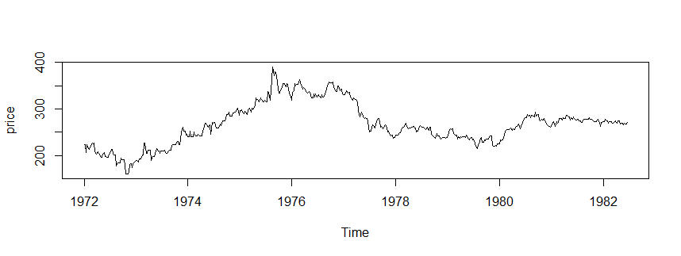
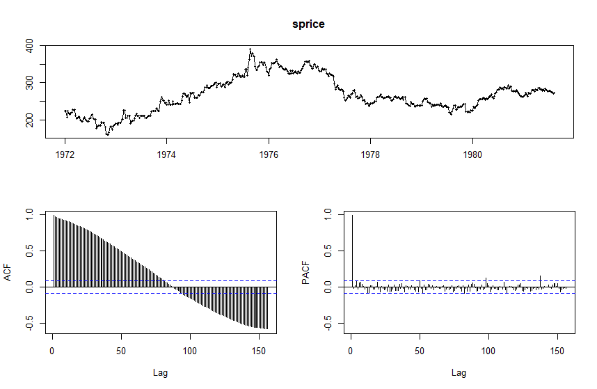
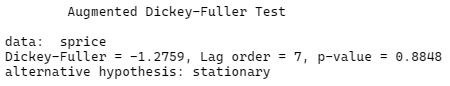
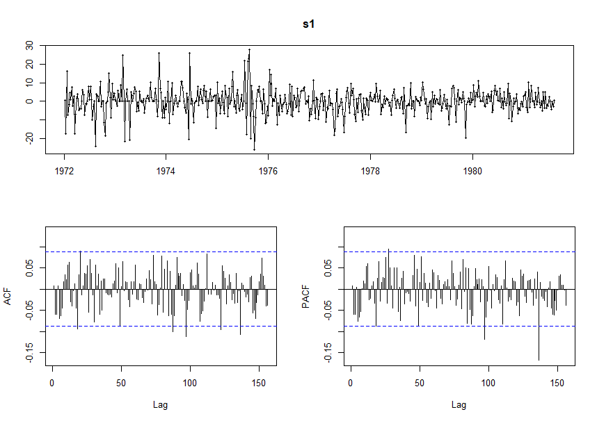
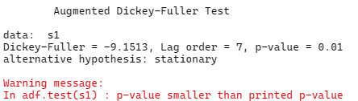
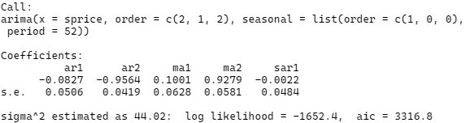
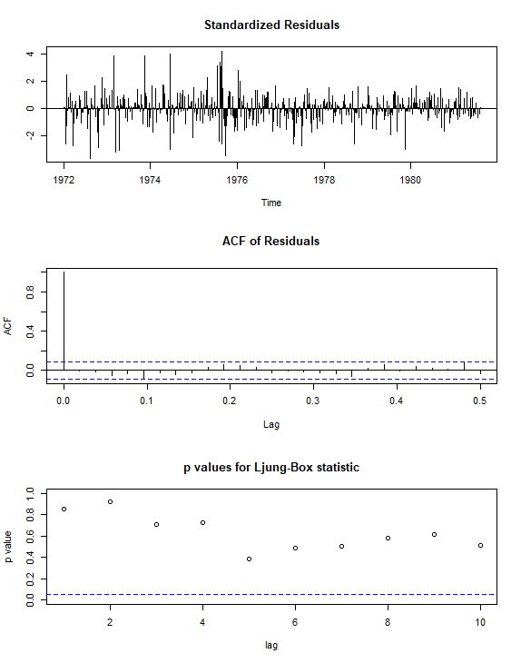
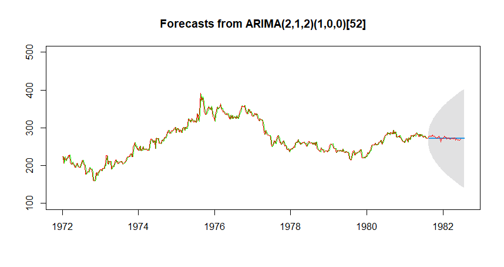
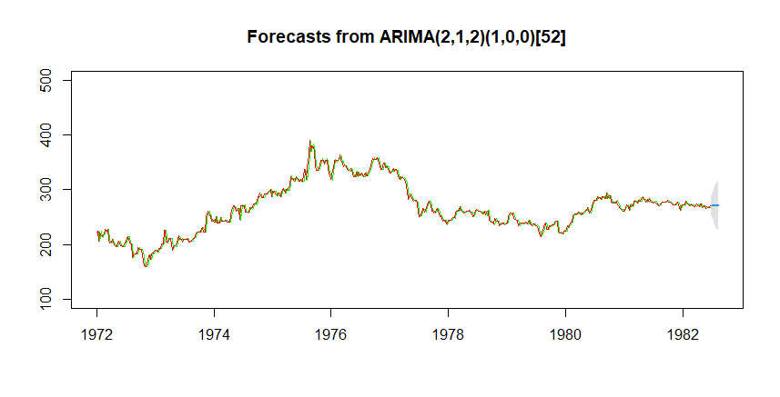
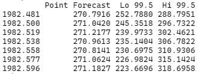

# 金融数据挖掘 第一次作业

## 作业要求

请利用附件提供的期货数据构建时间序列预测模型，并对接下来的价格进行预测

## 作业报告

### 数据预处理

本报告选取的时间序列数据集为 “黄金周数据.csv” ，数据以周为单位，共计 540 条数据。

读入数据后，首先将数据转换为时序结构，并画出图像，如下图所示：



为了更好的衡量模型的预测效果，我将原始的数据分为两个部分，分别作为模型的训练集和测试集，其比例为 9：1 ，即将数据前就年的数据拿出来用作模型的训练，并对第 10 年数据进行预测，并与第 10 年的真实数据进行比较，以此来衡量模型预测的效果。

画出训练集图像并进行 ACF 和 PACF 检验：



从图中可以看到，PACF 图像为明显的 1 阶截尾图像，而ACF 图像既不是明显的拖尾或截尾图像，同时从数据中也可以看到，其随着经济的繁荣和衰落会出现一个明显的波动趋势，故初步判断该序列并非平稳序列，对其进行单位根（ADF）检验以进一步确认我们的猜想：



从单位根检验的结果来看，p-value 为 0.88 ，故我们认为其是一个非平稳时间序列，故我们不能对其直接进行建模，而应考虑其差分序列的情况。

为了获得一个平稳的时间序列，需要去掉原数据的趋势，我们考虑对原数据取一阶差分，并观察差分之后的图像、ACF 图像和 PACF 图像：



从图像中不难看出，原来的趋势已经成功消除了，并且 ACF 图像可以大致看成 135 阶截尾，而 PACF 图像也可以看成 135 阶截尾。为了确保数据可以用于建模，我们对一阶差分数据进行单位根检验，检验结果如下图：



从结果中可以看出，数据通过了单位根检验，即数据是平稳的。

至此，我们得到了可以用于建模的数据。

### 模型建立

我们选取的模型为 ARIMA 模型（自回归积分滑动平均模型 Autoregressive Integrated Moving Average Model）。在 ARIMA(p，d，q) 中，AR 是“自回归”，p 为自回归项数；MA 为“滑动平均”，q 为滑动平均项数，d 为使之成为平稳序列所做的差分次数（阶数）。其模型数学表达式为：
$$
(1-\sum_{i=1}^p\phi_iL^i)(1-L)^dX_t = (1+\sum_{i=1}^q\theta_iL^i)\varepsilon_t
$$
下面我们依次分析各个阶数的取值：由于刚刚进行一阶差分后模型变为平稳，故 d 应取 1 ；根据上一部分的 ACF 图和 PACF 图与 ACF 和 PACF 定阶准则，可以发现 p 取 2 或 100，q 取 2、90 或 140。

由于上述参数 p 和 q 均有多个取值，故我们可以考虑以下两种方式对模型进行定阶：依据不同的参数组合，分别建立多个模型，并比较每个模型的 AIC 信息准则，选取 AIC 最小的模型；使用 auto.arima() 函数自动定阶。

经过模型的筛选，我们最终选取的模型为 ARIMA(2,1,2) ，并带有 (1,0,0)[52] 的季节趋势，模型的AIC信息准则大小为 3316.8，模型的各个参数如下图：



### 模型检验

对模型残差进行相关检验，以确保其为白噪声序列：



根据上图可以看到，残差基本均匀的分布在 0 的两侧，其 ACF 检验在高阶的时候也没有出现自相关的情况，其 Ljung-Box 检验也均表示其为白噪声序列，故我们认为其残差为白噪声，模型检验通过。

### 模型预测

利用该模型进行预测，首先看一下其在测试集上的效果：



图中红色为原始数据，绿色为利用模型计算出来的原始数据拟合值，蓝色为模型预测值，可以看到，红色线与绿色线几乎全部重合，模型在训练集上拟合效果很好，在测试集上，红线也是围绕蓝线上下波动，并且二者十分接近，拟合效果也比较显著。

下面将测试集放入训练集中，依照上述方式重新建模，并进行样本外预测：



预测值如下：



### 总结与反思

此次作业在完成过程中主要遇到了两个问题：

- 一阶差分成为了白噪声，正常的步骤应该在建立模型之前对数据进行白噪声检验以确保数据不是白噪声的，因为对白噪声建模没有任何意义。但我只要对数据进行差分，立刻无法通过白噪声检验，并产尝试多种方法，可惜没有效果，故只好拿白噪声进行建模。不清楚这个有什么好的处理方式嘛。

- 预测值趋于平坦，且置信区间在不断扩大。我认为这个问题是我拿白噪声建模进行的产生的必然结果，因为再强大的模型也无法从没有规律的数据中找出规律并进行外推...

## Reference

- https://blog.csdn.net/heirenmin/article/details/93317354
- https://blog.csdn.net/gdyflxw/article/details/55509656
- https://baike.baidu.com/item/ARIMA%E6%A8%A1%E5%9E%8B

## Appendix

本次作业源代码：

```R
library(tseries)
library(forecast)
# 设置工作目录并读取数据
setwd('H:\\Program Products\\Python Files\\0 Jupyter\\FDM-Project-2021\\dataset\\期货价格数据\\使用数据\\')

da <- read.csv("./黄金周数据.csv",head=F)
names(da) <- c('date','price')
head(da)

price <- da$price
price = ts(da$price,frequency=52,start=c(1972,1,10))
head(price)
plot.ts(price)

tsdisplay(price)

# 拆掉最后一年做样本的测试集
sprice<-ts(as.vector(price[1:500]),frequency=52,start=c(1972,1,10))
tsdisplay(sprice)
adf.test(sprice)

# 明显存在按经济波动增长的趋势，故利用差法将其干掉
s1<-diff(sprice,1)
# 单位根检验判断是否平稳
adf.test(s1)
# 检验通过
tsdisplay(s1)

# 图像显示acf与pac均存在截尾情况
# 根据pacf图像可判断 p 取 2 或 100
# 根据acf图像可判断 q 取 2 90 或 140

# 进行模型拟合，看看哪个效果好
a <- auto.arima(sprice)
summary(a)

arima(sprice,order=c(2,1,2))
arima(sprice,order=c(100,1,2))
arima(sprice,order=c(2,1,90))
arima(sprice,order=c(2,1,140))
arima(sprice,order=c(100,1,120))
arima(sprice,order=c(100,1,90))

#先进行拟合
fit1<-arima(sprice,order=c(2,1,2),seasonal=list(order=c(1,0,0),period=52))
#然后tsdiag看一下各自的结果,Ljung-Box检验的p值都在0.05之上，结果不错。
tsdiag(fit1)
fit1

#预测
f.p1<-forecast(fit1,h=50,level=c(99.5))
plot(f.p1,ylim=c(100,500))
lines(f.p1$fitted,col="green")
lines(price,col="red")

# 利用全部数据进行建模

#先进行拟合
fit2<-arima(price,order=c(2,1,2),seasonal=list(order=c(1,0,0),period=52))
tsdiag(fit2)

#预测
f.p2<-forecast(fit2,h=7,level=c(99.5))
plot(f.p2,ylim=c(100,500))
lines(f.p2$fitted,col="green")
lines(price,col="red")
f.p2
```

