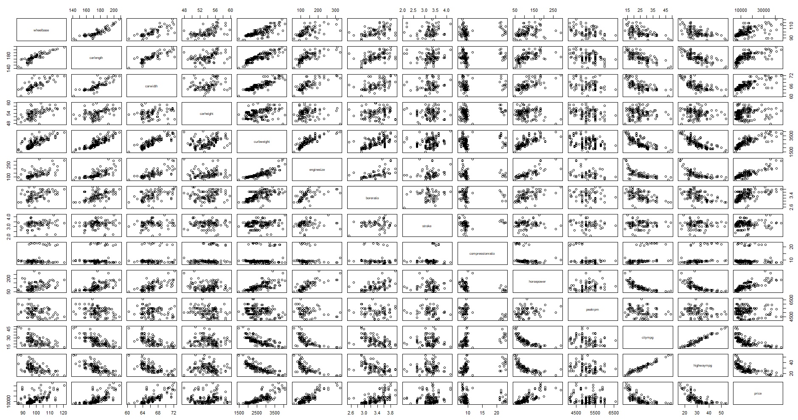

# 金融数据挖掘 第二次作业

## 作业要求

完成基于回归模型的预测，数据集任选

## 作业报告

### 数据预处理

本报告所选取的数据集为 Kaggle 网站上的公开数据集，内容与价格预测相关，为二手汽车价格预测数据集。数据主要从不同方面对一辆二手汽车进行描述，并给出该汽车最终成交的价格，我们要做的就是找到这些信息之间和最终成交价格的关系，并在已知相关信息的情况下进行成交价格的预测。

原始数据的情况如下：


可以看到，其中包括较多的离散型变量，而经典的线性回归模型对于离散变量的处理并不友好，通常情况下，模型中若想引入一个离散变量，就要添加该离散变量取值个数减一个虚拟 0 - 1 变量，这会大大增加模型的复杂程度，故我们考虑在尽量少的引入虚拟变量的情况下建立模型，对价格进行预测。

最终，我们筛选出如下变量，共计 13 个（未统计因变量）


### 模型建立

我们将数据导入后，首先观察各个变量之间的相关性，以对模型是否存在多重共线性进行初步的判断：



从上图中可以看到，只有少部分数据之间存在良好的线性关系，而绝大部分的数据之间是没有明显趋势的，这个结果可以在一定程度上说明各个变量之间存在的相关关系较少，故多重共线性存在的可能并不明显。


上图也进一步强化了这个观点，只有 citympg 和 highwaymapg 这两个变量之间存在较大的相关关系，并和其他变量存在较大的负向相关关系；同时，carwidth 与 carlength 之间也存在一定的相关关系，这个是可以理解的，因为通常情况下汽车的长宽是成一定比例的，因此会具有较高的相关性。

我们选取上述变量进行多元线性回归模型的建立，结果如下图所示：


对模型进行拟合优度检验，F 检验 和 t 检验，结果如下：


可以看到，其模型的拟合优度约为 0.84 ，是一个拟合程度相对较好的模型。其 F 检验的结果也证明了这一点，p-value 值远远小于 0.5，说明模型可以通过 F 检验。不过从 t 检验的结果来看，这模型并不是一个十分优秀的模型，多数变量无法通过 t 检验，说明模型中存在一定的多重共线性问题。


从模型残差情况来看，可以看到模型的残差并不完美的服从正态分布，而是存在一定的异方差现象，同时几个异常值点的存在也让模型的拟合效果有所下降，从图中可以找到 17,50,129,130 这几个异常值点。

故下一步考虑从这个模型出发，重新建立一个模型，在剔除掉异常值点的情况下进行逐步回归分析，以修正模型的多重共线性。

剔除掉异常点之后的模型数据描述性统计和不同变量之间的相关性如下：


剔除掉异常点之后的模型如下：


其相关检验的结果如下：


从结果不难发现，在去掉异常点之后，模型的拟合优度有所上升，拟合效果更好了，同时变量的显著性检验的结果也有所改善，有更多的变量可以通过这个显著性检验了。不过依然有变量无法通过检验，说明这个情况下模型依然存在一定程度的多重共线性，需要我们手动进行修正。

我们考虑使用逐步回归法进行多重共线性的修正，故对原模型进行向后回归，得到如下结果：


最终的模型去掉了两个变量，保留了 10 个变量，此时模型检验的结果如下：


可以看到，目前所有变量已经全部通过 t 检验，模型多重共线性得到修正。

### 模型检验

观察修正多重共线性之后模型的残差分布情况：


由于刚刚异常值去除的缘故，目前残差均在一定的范围之内（没有离群的情况出现），但从残差分布图中不难发现，在不同的取值范围下，模型的残差并不相等，也就是我们常说的模型存在异方差的情况，这也是违背经典假设的情况之一，会对模型的拟合效果产生一定的影响，故我们也要想办法将其消除。


我们可以明显的观察到，模型在 100 左右时的残差方差要明显大于其他情况，方差属于先增大后减小的趋势。

### 模型修正

我们利用加权最小二乘（Weighted Least Squares）的方式对异方差的情况进行修正，以 e 的残差平方次方的倒数为权重，即：
$$
w_i = \frac{1}{e^{\varepsilon_i^2}}
$$
进行加权最小二乘模型的构建：


观察加权最小二乘模型残差的分布情况：


可以看到，虽然修正后的模型仍然存在一定的异方差情况（可能是权重的选择出现了一定的问题），但相比经典最小二乘模型已经有了一定的进步，我们利用这个模型对价格进行预测。

### 模型预测

对模型进行训练样本预测，并给出 0.95 置信区间。


可以看到，模型的拟合效果还是不错的，所有样本均落在了置信区间之内，并且预测值与真实值是十分接近的。

## Reference

- https://archive.ics.uci.edu/ml/datasets/Automobile

## Appendix

本次作业源代码：

```R
# 设置工作目录并读取数据
setwd('H:\\Program Products\\Python Files\\0 Jupyter\\FDM-Project-2021\\dataset\\CarPrice')

da <- read.csv("./CarPrice-n.csv",head=T)
# names(da) <- c('date','price')
da.all <- da
da <- da[-1]
head(da.all)

pairs(as.data.frame(da))

# 相关系数矩阵
library(corrplot)
library(RColorBrewer)
M <- cor(da)
corrplot(M,type = "upper", # 只显示上三角
         order = "hclust",col = brewer.pal(n = 8,name = "RdYlBu"))

# 建立多元线性回归模型
car.lm <- lm(price~.,data=da)

car.lm

summary(car.lm)

par(mfrow=c(2,2))
plot(car.lm)


# 可以看到明显的异常点17，50，129，130
da.new <- da[c(-17,-50,-129,-130),]
head(da.new)

# 建立多元线性回归模型
car.lm.new <- lm(price~.,data=da.new)

car.lm.new

summary(car.lm.new)

par(mfrow=c(2,2))
plot(car.lm.new)

# 逐步回归
car.lm.new.step <- step(car.lm.new,direction="both")

car.lm.new.step

summary(car.lm.new.step)

par(mfrow=c(2,2))
plot(car.lm.new.step)

# 异方差检验与修正
par(mfrow=c(1,1))
e<-resid(car.lm.new.step)  # 计算残差
attach(da.all)
plot(car_ID[c(-17,-50,-129,-130)],e)
abline(h=c(0),lty=5)  # 添加虚线e=0
detach(da.all)

abse<-abs(e)
cor.test(da.all$car_ID[c(-17,-50,-129,-130)],abse,alternative="two.sided",method="spearman",conf.level=0.95)

# 异方差修正 加权最小二乘
fit <- lm(log(resid(car.lm.new.step)^2) ~ wheelbase + carlength + carwidth + carheight + curbweight + 
              enginesize + boreratio + stroke + compressionratio + horsepower + 
              peakrpm + citympg + highwaympg, data=da.new)
fit2 = lm(price ~ wheelbase + carlength + carwidth + carheight + curbweight + 
              enginesize + boreratio + stroke + compressionratio + horsepower + 
              peakrpm + citympg + highwaympg, data=da.new,weights=(1/exp(fitted(fit))))
fit2
summary(fit2)

plot(fit2)

library('GGally')
ggpairs(data=da.new)

ans <- predict(fit2,interval="prediction",level=0.95)

plot(ans)

plot(da.all$car_ID[c(-17,-50,-129,-130)],da.all$price[c(-17,-50,-129,-130)])
lines(da.all$car_ID[c(-17,-50,-129,-130)],ans[,1],lty=1,col="red")
lines(da.all$car_ID[c(-17,-50,-129,-130)],ans[,2],lty=3,col="blue")
lines(da.all$car_ID[c(-17,-50,-129,-130)],ans[,3],lty=3,col="blue")
```


